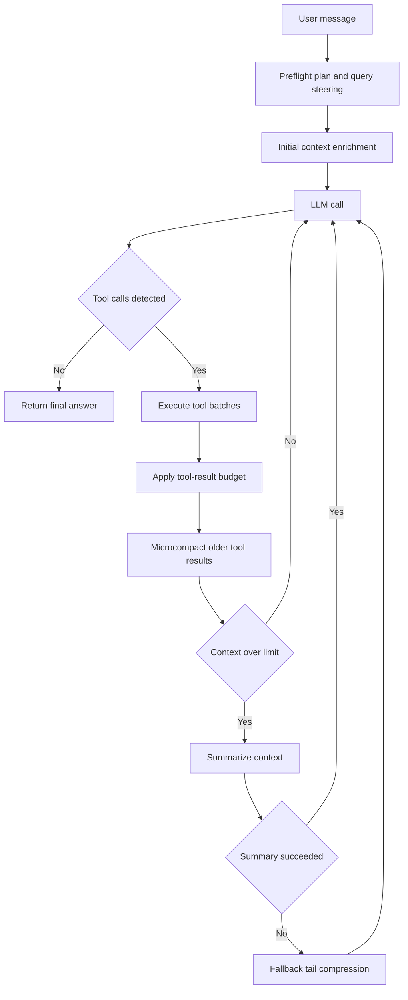

# JS Agent

Browser-first multi-step agent with hosted/local LLM routing, modular skill runtime, context-aware tool orchestration, and persistent session memory in local storage.

## Agent Loop Architecture

The runtime executes an explicit, bounded agentic loop:

1. Build system prompt and enriched initial context (preflight + intent hints)
2. Call active model lane (cloud or local)
3. Parse and normalize one or more tool calls
4. Execute tool batches (parallel only when concurrency-safe)
5. Apply tool-result context budget before persisting to history
6. Run context manager pipeline (microcompact old tool results, summarize only when needed)
7. Repeat until final answer or round limit



## Core Agentic Systems

- Preflight and enrichment:
   - Rule-based intent detection and optional short-timeout planner LLM call for optimized query/tool hints
   - Deferred prefetches for likely high-value context
- Tool selection and execution:
   - Registry-driven tool definitions with execution metadata (risk, read-only, concurrency-safe)
   - Safe batching for read-only concurrent tools
   - Source-compatible aliases for file/search operations
- Context manager:
   - Stable tool-result budgeting for large outputs
   - Lightweight microcompact of older `<tool_result>` blocks
   - LLM summarization with deterministic fallback compression and cooldown guard
- Loop guardrails:
   - Semantic near-duplicate detection for repeated `web_search` calls
   - Repeated-failure tool-call disablement
   - Max rounds and forced final-answer path with evidence warning
- Memory and persistence:
   - Session history, stats, tool cache, UI preferences, task/todo stores in `localStorage`
   - Cross-tab cache and busy-state synchronization via `BroadcastChannel`

## Project Structure

```text
Agent/
|- index.html
|- assets/
|- prompts/
|- docs/
|  `- agentic-search-arch.html
|- src/
|  |- app/
|  |  |- state.js
|  |  |- local-backend.js
|  |  |- tools.js
|  |  |- llm.js
|  |  `- agent.js
|  |- core/
|  |  |- orchestrator.js
|  |  |- prompt-loader.js
|  |  `- regex.js
|  `- skills/
|     |- core/
|     |  |- intents.js
|     |  `- tool-meta.js
|     |- modules/
|     |  |- filesystem-runtime.js
|     |  |- data-runtime.js
|     |  `- registry-runtime.js
|     |- groups/
|     |  |- web/index.js
|     |  |- device/index.js
|     |  |- data/index.js
|     |  `- filesystem/index.js
|     |- shared.js
|     `- index.js
`- proxy/
    `- ollama-cloud-worker.js
```

## Model Routing

Supported lanes:

- Cloud providers from Settings (`gemini/*`, `openai/*`, `claude/*`, `azure/*`, `ollama/*`)
- Local OpenAI-compatible endpoints (LM Studio, Ollama-style, or custom)

Behavior highlights:

- Local URL normalization and fast validation
- Multi-endpoint probing for compatibility (`/v1/models`, `/api/tags`)
- Fail-fast feedback on invalid/unreachable local host settings

## Skills Runtime

`window.AgentSkills.registry` is composed from grouped runtime modules.

Primary families:

- Web/context: `web_search`, `web_fetch`, `read_page`, `http_fetch`, `extract_links`, `page_metadata`
- Device/browser: datetime, geolocation, weather, clipboard, storage, notifications, tab messaging
- Filesystem: roots, authorization flow, list/read/write/search/tree/walk/stat/copy/move/delete/rename
- Data/planning: parse JSON/CSV, todos, tasks, question prompts, tool search

## Running

Open `index.html` in a Chromium-based browser. No build step required.

Recommended setup:

- Chrome/Edge for full File System Access API support
- Configured API key for cloud lanes
- Optional local backend or Ollama proxy endpoint for local/cloud hybrid routing

## Documentation

Detailed architecture reference is in `docs/agentic-search-arch.html`.
