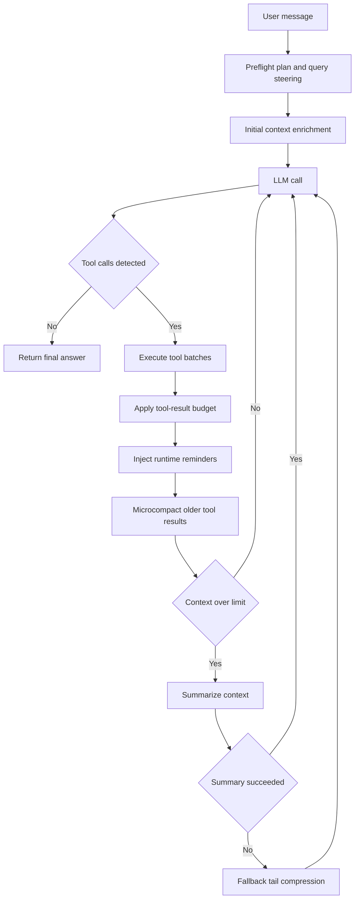

# JS Agent

Browser-first multi-step agent with hosted/local LLM routing, modular skill runtime, Clawd-style prompt composition, context-aware orchestration, and durable memory/cache layers in local storage.

## Agent Loop Architecture

The runtime executes an explicit, bounded agentic loop:

1. Build system prompt and enriched initial context (preflight + intent hints)
2. Call active model lane (cloud or local)
3. Parse and normalize one or more tool calls
4. Execute tool batches (parallel only when concurrency-safe)
5. Apply tool-result context budget before persisting to history
6. Inject runtime continuation reminders (`<system-reminder>`, tool summary, denial constraints, compaction notes)
7. Run context manager pipeline (microcompact old tool results, summarize only when needed)
8. Repeat until final answer or round limit



## Core Agentic Systems

- Preflight and enrichment:
   - Rule-based intent detection and optional short-timeout planner LLM call for optimized query/tool hints
   - Deferred prefetches for likely high-value context
- Clawd-style prompt composer:
   - Sectioned prompt assembly with static and dynamic boundaries in `src/core/orchestrator.js`
   - Runtime continuation prompt injection for tool summaries, permission denials, compaction signals, and safety reminders
- Tool selection and execution:
   - Registry-driven tool definitions with execution metadata (risk, read-only, concurrency-safe)
   - Safe batching for read-only concurrent tools
   - Source-compatible aliases for file/search operations
- Skills modularization:
   - `src/skills/shared.js` focuses on orchestration, preflight, and runtime wiring
   - `src/skills/modules/web-runtime.js` isolates web/search/weather/network provider logic
   - Flattened `src/skills/groups/*.js` files provide UI-facing group descriptors
- Context manager:
   - Stable tool-result budgeting for large outputs
   - Lightweight microcompact of older `<tool_result>` blocks
   - LLM summarization with deterministic fallback compression and cooldown guard
   - Time-based stale-result clearing after inactivity windows
- Loop guardrails:
   - Semantic near-duplicate detection for repeated `web_search` calls
   - Repeated-failure tool-call disablement
   - Prompt-injection signal detection from tool outputs with safe continuation warnings
   - Max rounds and forced final-answer path with evidence warning
- Memory and persistence:
   - Session history, stats, tool cache, UI preferences, task/todo stores in `localStorage`
   - Long-term memory extraction/retrieval for cross-turn personalization and continuity
   - Cross-tab cache and busy-state synchronization via `BroadcastChannel`

## Project Structure

```text
Agent/
|- index.html
|- assets/
|- prompts/
|- docs/
|  `- agentic-search-arch.html
|- src/
|  |- app/
|  |  |- state.js
|  |  |- local-backend.js
|  |  |- tools.js
|  |  |- llm.js
|  |  `- agent.js
|  |- core/
|  |  |- orchestrator.js
|  |  |- prompt-loader.js
|  |  `- regex.js
|  `- skills/
|     |- core/
|     |  |- intents.js
|     |  `- tool-meta.js
|     |- modules/
|     |  |- filesystem-runtime.js
|     |  |- data-runtime.js
|     |  |- registry-runtime.js
|     |  `- web-runtime.js
|     |- groups/
|     |  |- web.js
|     |  |- device.js
|     |  |- data.js
|     |  `- filesystem.js
|     |- shared.js
|     `- index.js
`- proxy/
    `- ollama-cloud-worker.js
```

## Model Routing

Supported lanes:

- Cloud providers from Settings (`gemini/*`, `openai/*`, `clawd/*`, `azure/*`, `ollama/*`)
- Local OpenAI-compatible endpoints (LM Studio, Ollama-style, or custom)

Behavior highlights:

- Local URL normalization and fast validation
- Multi-endpoint probing for compatibility (`/v1/models`, `/api/tags`)
- Fail-fast feedback on invalid/unreachable local host settings

## Skills Runtime

`window.AgentSkills.registry` is composed from grouped runtime modules.

Primary families:

- Web/context: `web_search`, `web_fetch`, `read_page`, `http_fetch`, `extract_links`, `page_metadata`
- Device/browser: datetime, geolocation, weather, clipboard, storage, notifications, tab messaging
- Filesystem: roots, authorization flow, list/read/write/search/tree/walk/stat/copy/move/delete/rename
- Data/planning: parse JSON/CSV, todos, tasks, question prompts, tool search

## Clawd Snapshot Integration

This repo now includes a Clawd snapshot adapter pipeline:

- Source input: `clawd-code-main/src` (workspace snapshot source folder)
- Transpiled output: `dist/clawd-code-main/src`
- Generated manifest: `dist/clawd-code-main/adapter/clawd-snapshot-manifest.json`
- Runtime data bridge: `src/skills/generated/clawd-snapshot-data.js`

Build command:

```bash
npm run build:clawd-snapshot
```

Runtime effects after build:

- Imports bundled skill metadata from the snapshot (`snapshot_skill_catalog`)
- Registers per-skill pseudo-tools (`snapshot_skill_*`) backed by sanitized prompt templates
- Extends `tool_search` with imported snapshot skill hits
- Appends sanitized snapshot prompt guidance into system prompt assembly
- Reuses extracted prompt snippets (`DEFAULT_AGENT_PROMPT`, action safety, hooks, reminders, function-result-clearing, summarize-tool-results)
- Sanitizes provider/Clawd brand mentions inside extracted prompt/skill text

## Memory + Compaction + Cache

Clawd-style runtime upgrades now included:

- Long-term memory manager (`AgentMemory`) with durable write/search/list and auto-extraction from completed turns
- Memory tools in runtime: `memory_write`, `memory_search`, `memory_list`
- Context compaction improvements:
  - cached summary reuse (`context_summary` scoped cache)
  - stronger tool-result digests used by microcompact for older `<tool_result>` blocks
  - runtime continuation notes to keep loop state coherent after compaction
- Multi-scope retention cache (`AgentRuntimeCache`) with TTL + max entries + max bytes policy per scope

## Safety + Prompt Injection

- Tool outputs are treated as untrusted data.
- The loop records likely prompt-injection payload patterns in tool results.
- Continuation reminders are injected so the model keeps following system policy after suspicious tool output.
- Permission denial history is persisted inside the active run and converted into structured continuation constraints.

## Verification

Useful commands after changes:

```bash
npm run build:clawd-snapshot
npm run test:skills-smoke
node --check src/core/orchestrator.js
node --check src/app/agent.js
```

## Running

Open `index.html` in a Chromium-based browser. No build step required.

Recommended setup:

- Chrome/Edge for full File System Access API support
- Configured API key for cloud lanes
- Optional local backend or Ollama proxy endpoint for local/cloud hybrid routing

## Documentation

Detailed architecture reference is in `docs/agentic-search-arch.html`.
It includes the layered runtime map with the extracted `web-runtime.js` module and flattened group files.
