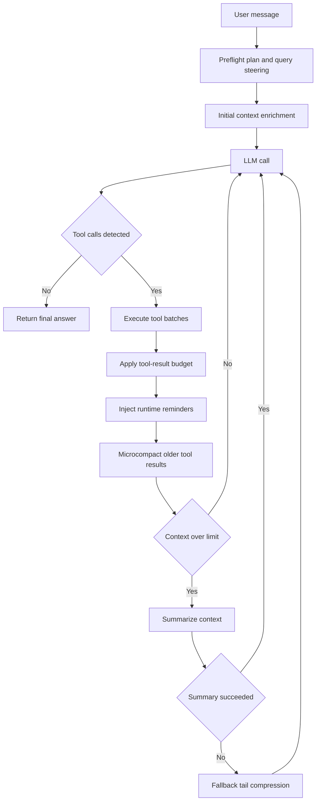

# JS Agent

Browser-first multi-step agent with hosted/local LLM routing, modular skill runtime, modular prompt composition, context-aware orchestration, and durable memory/cache layers in local storage.

## Agent Loop Architecture

The runtime executes an explicit, bounded agentic loop:

1. Build system prompt and enriched initial context (preflight + intent hints)
2. Call active model lane (cloud or local)
3. Parse and normalize one or more tool calls
4. Execute tool batches (parallel only when concurrency-safe)
5. Apply tool-result context budget before persisting to history
6. Inject runtime continuation reminders (`<system-reminder>`, tool summary, denial constraints, compaction notes)
7. Run context manager pipeline (microcompact old tool results, summarize only when needed)
8. Repeat until final answer or round limit



## Core Agentic Systems

- Preflight and enrichment:
   - Rule-based intent detection; optional short-timeout planner call for query/tool hints
   - Deferred prefetches for likely high-value context
- Modular prompt composer:
   - Sectioned prompt assembly in `src/core/orchestrator.js`
   - Runtime continuation prompt injection for tool summaries, permission denials, compaction signals, and safety reminders
- Tool selection and execution:
   - Registry-driven tool definitions with execution metadata (risk, read-only, concurrency-safe)
   - Safe batching for read-only concurrent tools
   - Source-compatible aliases for file/search operations
- Skills modularization:
   - `src/skills/shared.js` focuses on orchestration, preflight, and runtime wiring
   - `src/skills/modules/web-runtime.js` isolates web/search/weather/network provider logic
   - Flattened `src/skills/groups/*.js` files provide UI-facing group descriptors
- Context manager:
   - Stable tool-result budgeting for large outputs (20KB inline max, smart search tool boost)
   - Smart search tool preservation: search/query/lookup tools get 50% more budget allocation
   - Lightweight microcompact of older `<tool_result>` blocks
   - LLM summarization with deterministic fallback compression and cooldown guard
   - Time-based stale-result clearing after inactivity windows
- Loop guardrails:
   - Semantic near-duplicate detection for repeated `web_search` calls
   - Repeated-failure tool-call disablement
   - Prompt-injection signal detection from tool outputs with safe continuation warnings
   - Max rounds and forced final-answer path with evidence warning
- Memory and persistence:
   - Session history, stats, tool cache, UI preferences, task/todo stores in `localStorage`
   - Long-term memory extraction/retrieval for cross-turn personalization and continuity
   - Cross-tab cache and busy-state synchronization via `BroadcastChannel`

## Project Structure

```text
Agent/
|- index.html
|- assets/
|- prompts/
|- docs/
|  `- agentic-search-arch.html
|- proxy/
|  `- dev-server.js
|- scripts/
|  |- build-snapshot.mjs
|  |- test-skills-smoke.mjs
|  `- test-smoke.mjs
`- src/
   |- app/
   |  |- agent.js          # bounded agent loop, UI bindings, message renderers
   |  |- compaction.js      # context compaction, injection detection (window.AgentCompaction)
   |  |- constants.js       # centralized constants (window.CONSTANTS)
   |  |- llm.js             # multi-lane LLM routing, markdown renderers, abort control
   |  |- local-backend.js   # local endpoint probing (LM Studio, Ollama)
   |  |- permissions.js     # per-run denial tracking, escalation modes (window.AgentPermissions)
   |  |- runtime-memory.js  # runtime cache + long-term memory (window.AgentRuntimeCache/AgentMemory)
   |  |- state.js           # session state, localStorage, BroadcastChannel sync
   |  |- steering.js        # mid-flight guidance buffer (window.AgentSteering)
   |  |- tool-execution.js  # tool dispatch, batching, filesystem guards (window.AgentToolExecution)
   |  |- tools.js           # tool group rendering, enabledTools toggle
   |  `- ui-modern.js       # settings modal (window.openSettings/closeSettings)
   |- core/
   |  |- orchestrator.js    # system prompt builder, skill execution (window.AgentOrchestrator)
   |  |- prompt-loader.js   # prompt markdown loading (window.AgentPrompts)
   |  `- regex.js           # tool-call parsing helpers (window.AgentRegex)
   `- skills/
      |- snapshot-adapter.js
      |- core/
      |  |- intents.js
      |  `- tool-meta.js
      |- generated/
      |  `- snapshot-data.js
      |- modules/
      |  |- filesystem-runtime.js
      |  |- data-runtime.js
      |  |- registry-runtime.js
      |  `- web-runtime.js
      |- groups/
      |  |- web.js
      |  |- device.js
      |  |- data.js
      |  `- filesystem.js
      |- shared.js
      `- index.js
```

## Technical Orchestration

The main runtime is assembled directly in the browser from `index.html`. There is no bundler in the critical execution path. Instead, the ordered `defer` tags act as the dependency graph, and each layer publishes a narrow surface on `window` for the next layer to consume.

### Bootstrap Order From `index.html`

All 29 scripts are loaded with `defer`. The browser executes them in declaration order after HTML parsing, preserving the dependency graph without a bundler.

1. **Core parser and prompt loading**
   - `src/core/regex.js` — tool-call parsing and normalization helpers → `window.AgentRegex`
   - `src/core/prompt-loader.js` — prompt markdown loading → `window.AgentPrompts`

2. **Skill metadata and generated snapshot**
   - `src/skills/core/intents.js` — rule-based intent metadata
   - `src/skills/core/tool-meta.js` — tool display metadata
   - `src/skills/generated/snapshot-data.js` — prebuilt skill catalog → `window.AgentSnapshotData`
   - `src/skills/snapshot-adapter.js` — snapshot query API → `window.AgentClawdSnapshot` / `window.AgentSnapshot`

3. **Runtime module factories** (each registers onto `window.AgentSkillModules`)
   - `src/skills/modules/filesystem-runtime.js`
   - `src/skills/modules/data-runtime.js`
   - `src/skills/modules/registry-runtime.js`
   - `src/skills/modules/web-runtime.js`

4. **Skill assembly**
   - `src/skills/shared.js` — composes factories into `window.AgentSkills` (preflight, registry wiring, aliases)
   - `src/skills/groups/web.js`, `device.js`, `data.js`, `filesystem.js` — UI group descriptors
   - `src/skills/index.js` — finalizes the skill surface

5. **Orchestrator**
   - `src/core/orchestrator.js` — system prompt builder, tool list composer, skill executor → `window.AgentOrchestrator`

6. **App state and cache**
   - `src/app/state.js` — session history, settings, localStorage, BroadcastChannel sync
   - `src/app/constants.js` — centralized constants replacing inline magic numbers → `window.CONSTANTS`
   - `src/app/runtime-memory.js` — scoped runtime cache + long-term memory → `window.AgentRuntimeCache`, `window.AgentMemory`

7. **Modular app-layer subsystems** (each IIFE publishes to `window.Agent*`)
   - `src/app/permissions.js` — per-run denial tracking, escalation modes → `window.AgentPermissions`
   - `src/app/compaction.js` — context compaction logic, injection detection → `window.AgentCompaction`
   - `src/app/steering.js` — mid-flight guidance buffer → `window.AgentSteering`, `window.clearSteering`, `window.sendSteering`

8. **Tool infrastructure**
   - `src/app/local-backend.js` — local endpoint probing (LM Studio, Ollama)
   - `src/app/tools.js` — tool group rendering, `enabledTools` toggle
   - `src/app/tool-execution.js` — tool dispatch, batching, filesystem guards → `window.AgentToolExecution`

9. **LLM and agent loop**
   - `src/app/llm.js` — multi-lane LLM routing, markdown renderers, abort control → `window.AgentLLMControl`
   - `src/app/agent.js` — bounded agent loop, message rendering, UI wiring → all inline-handler globals
   - `src/app/ui-modern.js` — settings modal → `window.openSettings`, `window.closeSettings`

The ordering matters: skills must assemble before the orchestrator can describe available tools, and the orchestrator must exist before `agent.js` composes prompts. `constants.js` must load before any module that reads `window.CONSTANTS`.

### How The Scripts Become The Agent Loop

1. A UI action hands the latest user message to `src/app/agent.js`.
2. The loop pulls retrieved memory and runtime context from `window.AgentMemory`, then asks `window.AgentSkills` to build enriched initial context with preflight hints, `query_plan`, and any prefetched signals.
3. `src/app/tools.js` delegates to `window.AgentOrchestrator.buildSystemPrompt(...)`, which merges prompt templates with live tool metadata and runtime constraints.
4. `src/app/llm.js` sends the request to the selected cloud or local lane and normalizes provider-specific output into a single reply string.
5. `src/app/agent.js` strips non-executable reasoning, parses tool calls with `src/core/regex.js`, and, when needed, runs a bounded repair pass against `prompts/repair.md` so malformed tool intent can be rewritten into valid `<tool_call>` blocks.
6. Tool calls execute through the registry-backed skills runtime. Their results are budgeted, cached, and appended to history as `<tool_result>` messages.
7. `window.AgentOrchestrator.buildRuntimeContinuationPrompt(...)` injects the next-step reminder block, including tool summaries, permission denials, and compaction notes.
8. The loop repeats until the model returns a final answer or the round limit is reached.

The split is deliberate: the skills layer decides what capabilities exist, the orchestrator decides how those capabilities are presented to the model, and the agent loop decides when to call the model again, repair malformed intent, execute tools, compact context, or stop.

### Modular App Layer

After the refactor, `src/app/agent.js` delegates the bulk of its stateful subsystems to sibling modules loaded before it. Each module is an IIFE that publishes a named API onto `window`:

| Window property | File | Responsibility |
|---|---|---|
| `window.CONSTANTS` | `constants.js` | Centralized constants (budgets, thresholds, timeouts) |
| `window.AgentPermissions` | `permissions.js` | Per-run denial list, escalation mode (`default` → `deny_write`), permission hooks |
| `window.AgentCompaction` | `compaction.js` | Repeated-call counters, failure tracking, prompt-injection signal list, context compaction helpers |
| `window.AgentSteering` | `steering.js` | Mid-flight guidance buffer; `push()` / `drain()` / `clear()` / `send()` |
| `window.AgentToolExecution` | `tool-execution.js` | Tool dispatch, concurrency batching, filesystem path guards, stable hash, run-chain ID |
| `window.AgentLLMControl` | `llm.js` | Abort controller reference, `abortActiveLlmRequest()` |

Inline-handler globals exposed by `agent.js` for HTML `onclick`/`onkeydown` attributes:
`useExample`, `handleKey`, `autoResize`, `sendMessage`, `requestStop`, `setStatus`, `clearSession`

Inline-handler globals from sibling modules:
`clearSteering`, `sendSteering` (from `steering.js`), `openSettings`, `closeSettings` (from `ui-modern.js`)

### Supporting Build And Verification Scripts

- `npm run build:snapshot` runs `scripts/build-snapshot.mjs`, which regenerates `src/skills/generated/snapshot-data.js` from the snapshot source.
- `npm run test:skills-smoke` runs `scripts/test-skills-smoke.mjs`, a focused smoke test for the skills registry, snapshot, and memory subsystems.
- `npm run test:smoke` runs `scripts/test-smoke.mjs`, the comprehensive smoke test covering all runtime layers: constants, skills, memory, orchestrator, modular app APIs, markdown renderers, window global exports, and dev-server routes.

## Model Routing

Supported lanes:

- Cloud providers from Settings (`gemini/*`, `openai/*`, `claude/*`, `azure/*`, `ollama/*`)
- Local OpenAI-compatible endpoints (LM Studio, Ollama-style, or custom)

- Local URL normalization and fast validation
- Multi-endpoint probing for compatibility (`/v1/models`, `/api/tags`)
- Fail-fast feedback on invalid/unreachable local host settings
- Automatic fallback to cloud lane when a local request fails at runtime
- Per-endpoint attempt summaries in local errors to distinguish transport vs schema failures
- Safer local timeout floors for short planner/control calls to reduce false timeout churn

## Skills Runtime

`window.AgentSkills.registry` is composed from grouped runtime modules.

Primary families:

- Web/context: `web_search`, `web_fetch`, `read_page`, `http_fetch`, `extract_links`, `page_metadata`
- Device/browser: datetime, geolocation, weather, clipboard, storage, notifications, tab messaging
- Filesystem: roots, authorization flow, list/read/write/search/tree/walk/stat/copy/move/delete/rename
- Data/planning: parse JSON/CSV, todos, tasks, question prompts, tool search


## Memory + Compaction + Cache

- Long-term memory manager (`AgentMemory`) with durable write/search/list and auto-extraction from completed turns
- Memory tools in runtime: `memory_write`, `memory_search`, `memory_list`
- Context compaction improvements:
  - cached summary reuse (`context_summary` scoped cache)
  - aggressive tool-result budgeting: 20KB inline max, 5KB preview chunks (up from 6KB/1.8KB), keeps 15 recent results
  - intelligent compaction for search tools: web_search/web_fetch/read_page get 7.5KB preservation (50% boost)
  - stronger tool-result digests used by microcompact for older `<tool_result>` blocks
  - runtime continuation notes to keep loop state coherent after compaction
- Multi-scope retention cache (`AgentRuntimeCache`) with TTL + max entries + max bytes policy per scope

## UI Rendering Pipeline

The UI rendering system automatically detects and transforms message content for readability and formatting.

### Markdown Detection and Rendering

**`containsMarkdown(text)`** checks for syntax patterns:
- Headings: `## Title`
- Tables: `| column | column |`
- Fenced code: `` ``` ``
- Lists: `- item` or `1. item`
- Bold/italic: `**text**`, `__text__`, `*text*`, `_text_`
- Inline code: `` `code` ``
- Blockquotes: `> quote`
- Horizontal rules: `---`

### Rendering Pipeline

1. **Detection Phase**: `containsMarkdown()` scans content for markdown syntax
2. **Block Rendering**: `renderMarkdownBlocks(text)` transforms block-level markdown to HTML:
   - Fenced code blocks with language syntax highlighting support
   - Headings (## through ####) with proper semantic levels
   - Markdown tables (`| Header | Header |`) with `<table>`, `<thead>`, `<tbody>`
   - Ordered/unordered lists with proper nesting
   - Blockquotes with left border styling
   - Horizontal rules
3. **Inline Rendering**: `renderInlineMarkdown(text)` handles cell/line content:
   - Backtick code: `` `code` `` → `<code>`
   - Links: `[text](url)` → `<a>`
   - Bold: `**text**` / `__text__` → `<strong>`
   - Italic: `*text*` / `_text_` → `<em>`
4. **HTML Sanitization**: `sanitizeHtmlFragment()` strips unsafe tags and attributes; whitelisted: `<p>`, `<h1-6>`, `<code>`, `<pre>`, `<table>`, `<tr>`, `<td>`, `<th>`, `<ul>`, `<ol>`, `<li>`, `<blockquote>`, `<strong>`, `<em>`, `<a>`, `<hr>`

### Message Rendering in `addMessage()`

**User Messages:**
- If `containsMarkdown()` detects markdown: render via `renderAgentHtml()` + `html-body` CSS class (pretty formatting)
- Else: plain text with `textContent` (no rendering)
- All text inside user bubble forced to white for readability on blue background

**Agent Messages:**
- Always rendered via `renderAgentHtml()` with `html-body` CSS class
- Supports markdown + backward-compat HTML for legacy persisted messages

**Tool / Error / System Messages:**
- Collapsible `<details>` element with expandable summary
- Summary shows 120-char preview (truncated with `…`)
- Full content in scrollable `<pre>` block (max-height 400px)
- JSON payloads auto-formatted with `JSON.stringify(..., null, 2)`
- Badge shows `R{round} · call/result · role`

### Page Refresh and Re-rendering

`renderChatFromMessages()` is called on page load and session switch. It:
1. Clears the message container
2. Replays all stored messages through `addMessage()`
3. Markdown detection + rendering applies every time, so persisted messages always render correctly even after code updates

### Styling

- **User bubble**: `rgba(51, 122, 210, 0.75)` (darker semi-transparent blue) with white text
- **Agent bubble**: dark grey background with primary text color
- **Code blocks**: dark overlay with bright blue text
- **Tables**: styled with borders and dark header background
- **Links**: bright blue with underline

## Safety + Prompt Injection

- Tool outputs are treated as untrusted data.
- The loop records likely prompt-injection payload patterns in tool results.
- Continuation reminders are injected so the model keeps following system policy after suspicious tool output.
- Permission denial history is persisted inside the active run and converted into structured continuation constraints.

## Verification

Useful commands after changes:

```bash
# Comprehensive smoke test (all runtime layers)
npm run test:smoke

# Focused skills/snapshot/memory smoke test
npm run test:skills-smoke

# Syntax-check individual files
node --check src/core/orchestrator.js
node --check src/app/agent.js
node --check src/app/llm.js
node --check src/app/permissions.js
node --check src/app/compaction.js
node --check src/app/steering.js
node --check src/app/tool-execution.js
node --check src/app/constants.js
```

## Running

> **Do not open `index.html` directly in the browser or use Live Server.**
> The app requires the Node dev server so that Ollama Cloud API requests can be proxied server-side (browsers block cross-origin POST to `https://ollama.com`).

### Start the dev server

```bash
cd "/media/samuel/PNY 1TB/Code/Agent"
node proxy/dev-server.js
```

Then open **http://127.0.0.1:5500** in Chrome or Edge.

The server serves all static files on port 5500 and proxies `POST /api/ollama/v1/*` → `https://ollama.com/v1/*`.

#### Optional: set your Ollama Cloud API key via environment

```bash
OLLAMA_API_KEY="your-key" node proxy/dev-server.js
```

The server forwards the key as an `Authorization: Bearer` header when the client does not send one. You can also paste it directly in the Settings panel.

#### Use a different port

```bash
PORT=8080 node proxy/dev-server.js
# open http://127.0.0.1:8080
```

### First-time setup (Ollama Cloud)

1. In Settings → **Ollama**, paste your API key and click **Save**  
   (get a key at [ollama.com/settings/api-keys](https://ollama.com/settings/api-keys))
2. Click **Probe** to detect any locally installed models
3. Select a model from the dropdown (local or ☁ cloud)
4. Click **Enable Ollama** and start chatting

### Requirements

- Node.js 18+ (no npm install needed — dev-server.js uses only built-in modules)
- Chrome or Edge recommended (required for File System Access API)

## Local Ollama Troubleshooting

If local calls fail with errors like `500` and `{"error":"EOF"}` on `/api/chat` or `/api/generate`:

- Probe local backend again in Settings and reselect a model from the Local Model dropdown
- Verify Ollama has at least one pulled model and can answer direct API requests
- Keep local URL on `http://localhost:11434` for default Ollama unless intentionally using a custom host
- If you see `Local lane failed ... Falling back to cloud`, local routing failed and cloud takeover started as designed
- If fallback then fails with `400` from Gemini/OpenAI/other cloud provider, fix cloud provider settings/API key separately
- `favicon.ico 404` and extension message-channel warnings in browser consoles are usually unrelated to agent runtime logic

## Documentation

Architecture reference with runtime layer map and Mermaid diagrams: `docs/agentic-search-arch.html`.
