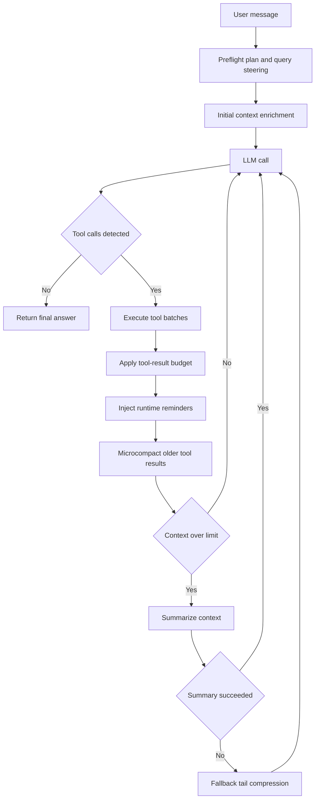

# JS Agent

Browser-first multi-step agent with hosted/local LLM routing, modular skill runtime, modular prompt composition, context-aware orchestration, and durable memory/cache layers in local storage.

## Agent Loop Architecture

The runtime executes an explicit, bounded agentic loop:

1. Build system prompt and enriched initial context (preflight + intent hints)
2. Call active model lane (cloud or local)
3. Parse and normalize one or more tool calls
4. Execute tool batches (parallel only when concurrency-safe)
5. Apply tool-result context budget before persisting to history
6. Inject runtime continuation reminders (`<system-reminder>`, tool summary, denial constraints, compaction notes)
7. Run context manager pipeline (microcompact old tool results, summarize only when needed)
8. Repeat until final answer or round limit



## Core Agentic Systems

- Preflight and enrichment:
   - Rule-based intent detection; optional short-timeout planner call for query/tool hints
   - Deferred prefetches for likely high-value context
- Modular prompt composer:
   - Sectioned prompt assembly in `src/core/orchestrator.js`
   - Runtime continuation prompt injection for tool summaries, permission denials, compaction signals, and safety reminders
- Tool selection and execution:
   - Registry-driven tool definitions with execution metadata (risk, read-only, concurrency-safe)
   - Safe batching for read-only concurrent tools
   - Source-compatible aliases for file/search operations
- Skills modularization:
   - `src/skills/shared.js` focuses on orchestration, preflight, and runtime wiring
   - `src/skills/modules/web-runtime.js` isolates web/search/weather/network provider logic
   - Flattened `src/skills/groups/*.js` files provide UI-facing group descriptors
- Context manager:
   - Stable tool-result budgeting for large outputs
   - Lightweight microcompact of older `<tool_result>` blocks
   - LLM summarization with deterministic fallback compression and cooldown guard
   - Time-based stale-result clearing after inactivity windows
- Loop guardrails:
   - Semantic near-duplicate detection for repeated `web_search` calls
   - Repeated-failure tool-call disablement
   - Prompt-injection signal detection from tool outputs with safe continuation warnings
   - Max rounds and forced final-answer path with evidence warning
- Memory and persistence:
   - Session history, stats, tool cache, UI preferences, task/todo stores in `localStorage`
   - Long-term memory extraction/retrieval for cross-turn personalization and continuity
   - Cross-tab cache and busy-state synchronization via `BroadcastChannel`

## Project Structure

```text
Agent/
|- index.html
|- assets/
|- prompts/
|- docs/
|  |- agentic-search-arch.html
|  `- ollama-cloud-cors-proxy.md
|- scripts/
|  |- build-snapshot.mjs
|  `- test-skills-smoke.mjs
|- proxy/
|  |- dev-server.js
|  `- ollama-cloud-worker.js
`- src/
   |- app/
   |  |- agent.js
   |  |- llm.js
   |  |- local-backend.js
   |  |- runtime-memory.js
   |  |- state.js
   |  |- tools.js
   |  `- ui-modern.js
   |- core/
   |  |- orchestrator.js
   |  |- prompt-loader.js
   |  `- regex.js
   `- skills/
      |- snapshot-adapter.js
      |- core/
      |  |- intents.js
      |  `- tool-meta.js
      |- generated/
      |  `- snapshot-data.js
      |- modules/
      |  |- filesystem-runtime.js
      |  |- data-runtime.js
      |  |- registry-runtime.js
      |  `- web-runtime.js
      |- groups/
      |  |- web.js
      |  |- device.js
      |  |- data.js
      |  `- filesystem.js
      |- shared.js
      `- index.js
```

## Technical Orchestration

The main runtime is assembled directly in the browser from `index.html`. There is no bundler in the critical execution path. Instead, the ordered `defer` tags act as the dependency graph, and each layer publishes a narrow surface on `window` for the next layer to consume.

### Bootstrap Order From `index.html`

1. Core parser and prompt loading:
   - `src/core/regex.js` defines the tool-call parsing and normalization helpers.
   - `src/core/prompt-loader.js` loads prompt markdown and fallback templates.
2. Skill metadata and generated snapshot:
   - `src/skills/core/intents.js` and `src/skills/core/tool-meta.js` define intent and tool metadata.
   - `src/skills/generated/snapshot-data.js` and `src/skills/snapshot-adapter.js` load the snapshot data used during prompt composition and compatibility shaping.
3. Runtime module factories:
   - `src/skills/modules/filesystem-runtime.js`
   - `src/skills/modules/data-runtime.js`
   - `src/skills/modules/registry-runtime.js`
   - `src/skills/modules/web-runtime.js`
   - These files register factories on `window.AgentSkillModules`.
4. Skill assembly:
   - `src/skills/shared.js` composes those factories into `window.AgentSkills`.
   - This is where preflight planning, `query_plan` generation, registry wiring, aliases, and memory-aware helpers are assembled.
   - `src/skills/groups/*.js` expose grouped UI metadata, and `src/skills/index.js` finalizes the skill surface.
5. Orchestrator:
   - `src/core/orchestrator.js` consumes the prompt loader plus `window.AgentSkills` and publishes `window.AgentOrchestrator`.
6. App runtime:
   - `src/app/state.js` wires state and settings.
   - `src/app/runtime-memory.js` publishes `window.AgentRuntimeCache` and `window.AgentMemory`.
   - `src/app/local-backend.js` handles local endpoint probing and compatibility checks.
   - `src/app/tools.js` exposes prompt/tool helpers used by the loop.
   - `src/app/llm.js` handles provider selection, request shaping, retries, and response normalization.
   - `src/app/agent.js` runs the bounded agent loop.
   - `src/app/ui-modern.js` binds the UI to the runtime.

The ordering matters. `src/skills/shared.js` must complete before `src/core/orchestrator.js` can describe the available tools, and the orchestrator must exist before `src/app/agent.js` starts composing prompts and running rounds. Because every file is loaded with `defer`, the browser preserves this sequence without needing a build-time module graph.

### How The Scripts Become The Agent Loop

1. A UI action hands the latest user message to `src/app/agent.js`.
2. The loop pulls retrieved memory and runtime context from `window.AgentMemory`, then asks `window.AgentSkills` to build enriched initial context with preflight hints, `query_plan`, and any prefetched signals.
3. `src/app/tools.js` delegates to `window.AgentOrchestrator.buildSystemPrompt(...)`, which merges prompt templates with live tool metadata and runtime constraints.
4. `src/app/llm.js` sends the request to the selected cloud or local lane and normalizes provider-specific output into a single reply string.
5. `src/app/agent.js` strips non-executable reasoning, parses tool calls with `src/core/regex.js`, and, when needed, runs a bounded repair pass against `prompts/repair.md` so malformed tool intent can be rewritten into valid `<tool_call>` blocks.
6. Tool calls execute through the registry-backed skills runtime. Their results are budgeted, cached, and appended to history as `<tool_result>` messages.
7. `window.AgentOrchestrator.buildRuntimeContinuationPrompt(...)` injects the next-step reminder block, including tool summaries, permission denials, and compaction notes.
8. The loop repeats until the model returns a final answer or the round limit is reached.

The split is deliberate: the skills layer decides what capabilities exist, the orchestrator decides how those capabilities are presented to the model, and the agent loop decides when to call the model again, repair malformed intent, execute tools, compact context, or stop.

### Supporting Build And Verification Scripts

- `npm run build:snapshot` runs `scripts/build-snapshot.mjs`, which regenerates `src/skills/generated/snapshot-data.js` from the snapshot source so the browser runtime can consume a prebuilt data file instead of transforming that source on load.
- `npm run test:skills-smoke` runs `scripts/test-skills-smoke.mjs`, which boots the same runtime scripts in a Node VM with browser stubs and checks that `window.AgentSkills`, the generated snapshot, memory/cache wiring, and orchestrator prompt composition still assemble correctly.

## Model Routing

Supported lanes:

- Cloud providers from Settings (`gemini/*`, `openai/*`, `claude/*`, `azure/*`, `ollama/*`)
- Local OpenAI-compatible endpoints (LM Studio, Ollama-style, or custom)

- Local URL normalization and fast validation
- Multi-endpoint probing for compatibility (`/v1/models`, `/api/tags`)
- Fail-fast feedback on invalid/unreachable local host settings
- Automatic fallback to cloud lane when a local request fails at runtime
- Per-endpoint attempt summaries in local errors to distinguish transport vs schema failures
- Safer local timeout floors for short planner/control calls to reduce false timeout churn

## Skills Runtime

`window.AgentSkills.registry` is composed from grouped runtime modules.

Primary families:

- Web/context: `web_search`, `web_fetch`, `read_page`, `http_fetch`, `extract_links`, `page_metadata`
- Device/browser: datetime, geolocation, weather, clipboard, storage, notifications, tab messaging
- Filesystem: roots, authorization flow, list/read/write/search/tree/walk/stat/copy/move/delete/rename
- Data/planning: parse JSON/CSV, todos, tasks, question prompts, tool search


## Memory + Compaction + Cache

- Long-term memory manager (`AgentMemory`) with durable write/search/list and auto-extraction from completed turns
- Memory tools in runtime: `memory_write`, `memory_search`, `memory_list`
- Context compaction improvements:
  - cached summary reuse (`context_summary` scoped cache)
  - stronger tool-result digests used by microcompact for older `<tool_result>` blocks
  - runtime continuation notes to keep loop state coherent after compaction
- Multi-scope retention cache (`AgentRuntimeCache`) with TTL + max entries + max bytes policy per scope

## Safety + Prompt Injection

- Tool outputs are treated as untrusted data.
- The loop records likely prompt-injection payload patterns in tool results.
- Continuation reminders are injected so the model keeps following system policy after suspicious tool output.
- Permission denial history is persisted inside the active run and converted into structured continuation constraints.

## Verification

Useful commands after changes:

```bash
npm run test:skills-smoke
node --check src/core/orchestrator.js
node --check src/app/agent.js
```

## Running

> **Do not open `index.html` directly in the browser or use Live Server.**
> The app requires the Node dev server so that Ollama Cloud API requests can be proxied server-side (browsers block cross-origin POST to `https://ollama.com`).

### Start the dev server

```bash
cd "/media/samuel/PNY 1TB/Code/Agent"
node proxy/dev-server.js
```

Then open **http://127.0.0.1:5500** in Chrome or Edge.

The server serves all static files on port 5500 and proxies `POST /api/ollama/v1/*` → `https://ollama.com/v1/*`.

#### Optional: set your Ollama Cloud API key via environment

```bash
OLLAMA_API_KEY="your-key" node proxy/dev-server.js
```

The server forwards the key as an `Authorization: Bearer` header when the client does not send one. You can also paste it directly in the Settings panel.

#### Use a different port

```bash
PORT=8080 node proxy/dev-server.js
# open http://127.0.0.1:8080
```

### First-time setup (Ollama Cloud)

1. In Settings → **Ollama**, paste your API key and click **Save**  
   (get a key at [ollama.com/settings/api-keys](https://ollama.com/settings/api-keys))
2. Click **Probe** to detect any locally installed models
3. Select a model from the dropdown (local or ☁ cloud)
4. Click **Enable Ollama** and start chatting

### Requirements

- Node.js 18+ (no npm install needed — dev-server.js uses only built-in modules)
- Chrome or Edge recommended (required for File System Access API)

## Local Ollama Troubleshooting

If local calls fail with errors like `500` and `{"error":"EOF"}` on `/api/chat` or `/api/generate`:

- Probe local backend again in Settings and reselect a model from the Local Model dropdown
- Verify Ollama has at least one pulled model and can answer direct API requests
- Keep local URL on `http://localhost:11434` for default Ollama unless intentionally using a custom host
- If you see `Local lane failed ... Falling back to cloud`, local routing failed and cloud takeover started as designed
- If fallback then fails with `400` from Gemini/OpenAI/other cloud provider, fix cloud provider settings/API key separately
- `favicon.ico 404` and extension message-channel warnings in browser consoles are usually unrelated to agent runtime logic

## Documentation

Architecture reference with runtime layer map and Mermaid diagrams: `docs/agentic-search-arch.html`.
